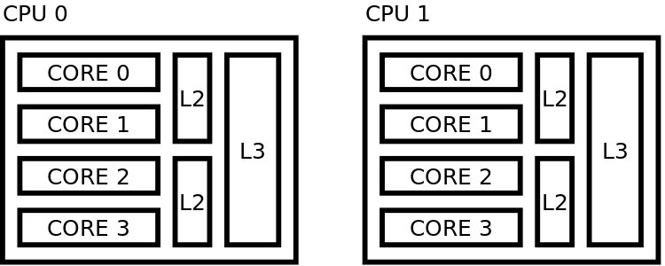

Pinning threads
===============

What is pinning
---------------

Pinning threads allows you to control the distribution of threads across available cores on your system, and is particularly
use full in high performance computing (HPC) systems.
This can improve the performance of your code.

Here you can find some general configuration options as well as some system specific options that we recommend.

Sequential pinning scheme
~~~~~~~~~~~~~~~~~~~~~~~~~

Description of what you're looking at

   sequential placing - cores closely packed

   fill cores of 1 processor before going to next

- possible disadvantage
   - threads need to fight for resources - slower
- possible advantages
   - could shut off 2nd processor - save energy
   - could share memory prefetching

Distant pinning scheme
~~~~~~~~~~~~~~~~~~~~~~

   distant placing

   maximizes distance between threads in hardware

Understanding my system
-----------------------

* ``lstopo``
     lstopo and lstopo-no-graphics are capable of displaying a topological map of the system

* ``htop``
      It is similar to top, but allows you to scroll vertically and horizontally, so you can see all the processes
      running on the system, along with their full command lines.

Finding your optimum [1]_

This depends on the system you are running and the resources available to  you
But in general  we recommend

* 1 thread per core
* --exclusive, full notde

Example Slurm script
~~~~~~~~~~~~~~~~~~~~

This is an example job script that shows the a commonly accepted configuration on HPC systems such as ...
You may need to alter the job script to optimize your the performance on the machine your're using

.. code-block:: bash

   #!/bin/bash -l
   #SBATCH --job-name="job_name"
   #SBATCH --account="project"
   #SBATCH --time=01:00:00
   #SBATCH --nodes=1
   #SBATCH --ntasks-per-core=1
   #SBATCH --ntasks-per-node=12
   #SBATCH --cpus-per-task=1
   #SBATCH --partition=normal
   #SBATCH --constraint=gpu
   #SBATCH --hint=nomultithread

   export OMP_NUM_THREADS=$SLURM_CPUS_PER_TASK
   export CRAY_CUDA_MPS=1

   srun ./executable.x

MPI
~~~

It's usually unclear whether MPI pins threads to cores.
After allocation of resources on which one wants to run the MPI processes, one also needs to export environemnt variables related the implementation of the multiprocessing API.

* OpenMPI
   * it appears that to use OpenMPI and Multithreading together one needs to, when building OpenMPI configure ``--enable-mpi-threads``
   * boost > 2.26(?) automatically contains an MPI implementation that can interfere

.. list-table:: OpenMPI settings
   :header-rows: 1

   * - Setting
     - Description
   *  - `exoort MPI_=True`
      - make it work
   *  - --map-by socket/node
      - map MPI processes to socket/node
   *  - --bind-to socket/node
      - bind MPI processes to socket/node
   *  - --rankfile rank.file
      - pass rankfile to precisely define threads on which to run a process (length of characters processed in rankfile is limited)
   *  - --report-bindings
      - report bindings of launched processes
   *  - --display-allocation
      - display detected allocation

Threading
~~~~~~~~~

* hardware threading settings
* power capping

.. list-table:: OpenMP settings
   :header-rows: 1

   * - export OMP_NUM_THREADS=#CPUSPERTASK#
     - variable telling OpenMP how many threads are used on a MPI process
   * - export OMP_PROC_BIN=true
     - no movement of threads between OpenMP threads and OpenMP places
   * - export OMP_PROC_BIN=close
     - no movement of threads between OpenMP threads and OpenMP places and OpenMP places are 'close' in a hardware sense
   * - export OMP_PLACES=threads/cores
     - each OpenMP place corresponds to a hardware thread/core
   * - export OPM_PLACES="{a : b : c}"
     - OpenMP places are a, a+b, a+2c, ... a+nc=b (numbering usually relates to cores/hardware threads)
   * - export OPM_DISPLAY_ENV=true
     - display OpenMP variables

Understanding how NEST works
----------------------------

Optimizing your system is only a part of the story. For optimal performance, your NEST script needs to be written efficiently too.

Here are some guides that can help you better understand NEST behavior.

* :ref:`parallel_computing`

* how to run simulations

* see also built-in timers? randomenss in NEST? input output

* benchmarking

Specific configuration options
------------------------------

Try setting settings at the hightest level first.

Scheduler
~~~~~~~~~

* Slurm

.. list-table:: General Slurm settings
   :header-rows: 1

   * - Setting
     - Description
   * - `export CPU_AFFINITY=True`
     - make stuff do something
   * - `--exclusive`
     - Always set this toa void other processes on the same node

.. list-table:: Slurm settings on specific machines
   :header-rows: 1

   * - Machine
     - Setting
     - Description
   * - JURECA
     -
     -
   * - JUSUF
     -
     -
   * - Piz Daint
     -
     -

* PBS / Torque

.. list-table:: PBS / Torque settings on specific machines
   :header-rows: 1

   * - Machine
     - Setting
     - Description

References
----------

.. [1] Kurth AC, et al. 2021. Sub-realtime simulation of a neuronal network of natural density. arXiv
       Web. https://arxiv.org/abs/2111.04398
